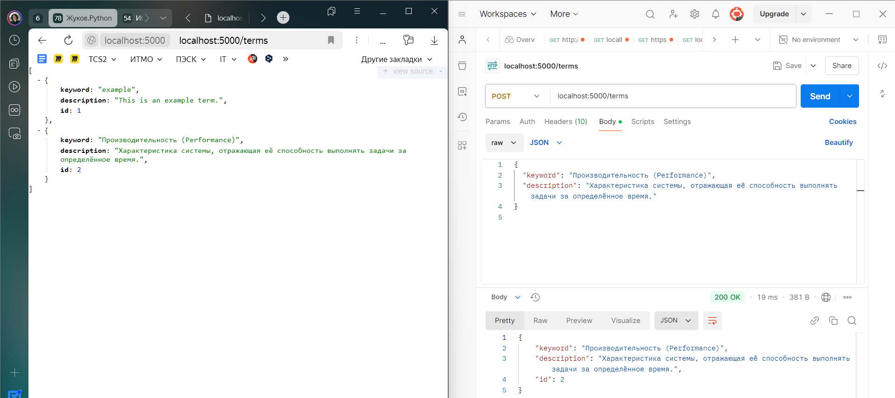
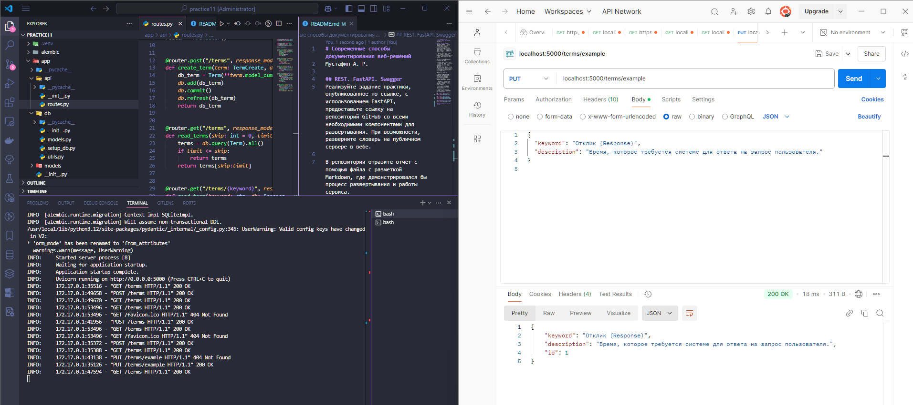
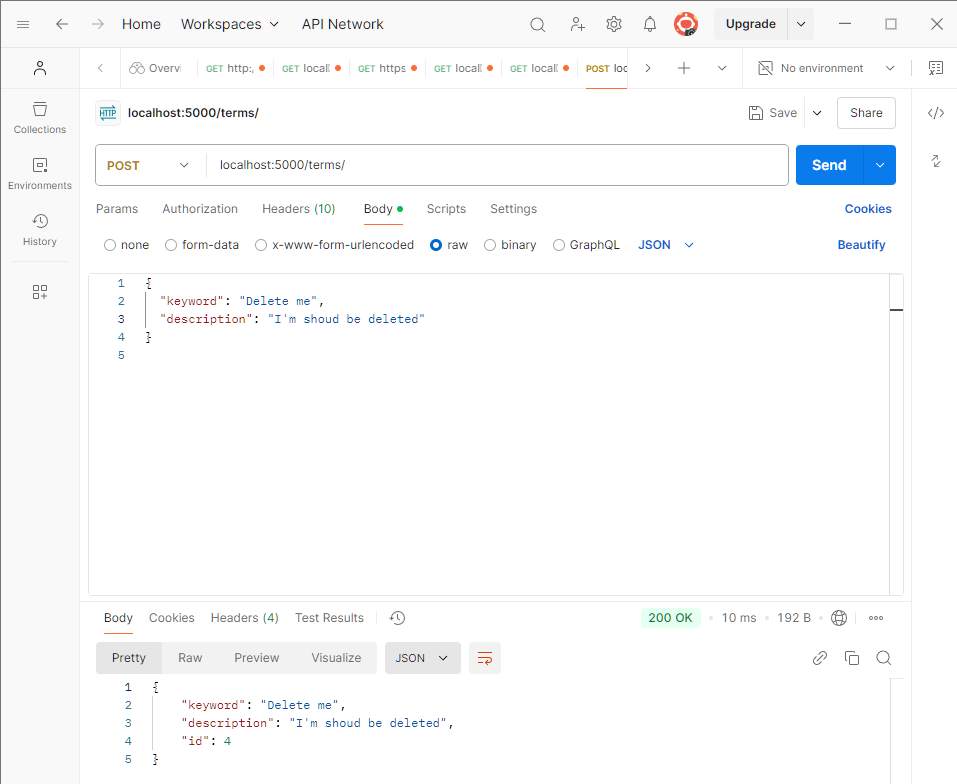
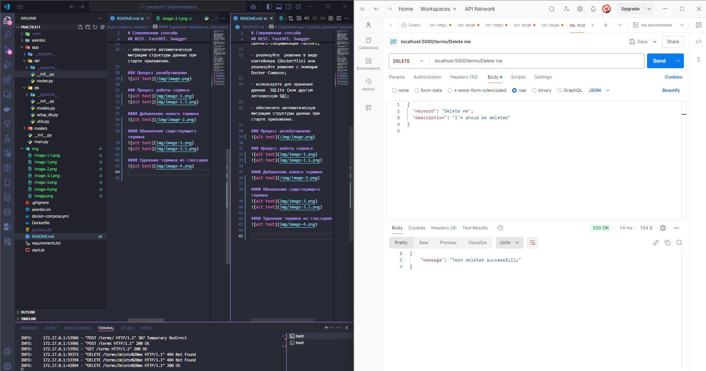

# Современные способы документирования веб-решений
Мустафин А. Р.

## REST. FastAPI. Swagger
Реализуйте задание практики, опубликованное по ссылке, с использованием FastAPI, предоставьте ссылку на репозиторий GitHub со всеми необходимыми компонентами для развертывания. При возможности, разверните словарь на публичном сервере в вебе. 

В репозитории отразите отчет с помощью файла с разметкой Markdown, где демонстрировался бы процесс развертывания и работы сервиса.

 Глоссарий должен поддерживать следующие операции:

Получение списка всех терминов.
Получение информации о конкретном термине по ключевому слову.
Добавление нового термина с описанием.
Обновление существующего термина.
Удаление термина из глоссария.
У вас должен применяться Pydantic для валидации входных данных и формирования схем. 

Будет плюсом, если вы:

- найдете и используете по назначению инструмент для автоматической генерации статической документации с помощью встроенной OpenAPI-спецификации FastAPI;

- реализуйте  решение в виде контейнера (Dockerfile) или реализуйте решение с помощью Docker Compose; 

- используете для хранения данных  SQLite (или другую легковесную БД);

- обеспечите автоматическую миграцию структуры данных при старте приложения. 

### Процесс развёртывания

### Процесс работы сервиса  

#### Добавление нового термина

#### Обновление существующего термина

#### Удаление термина из глоссария

